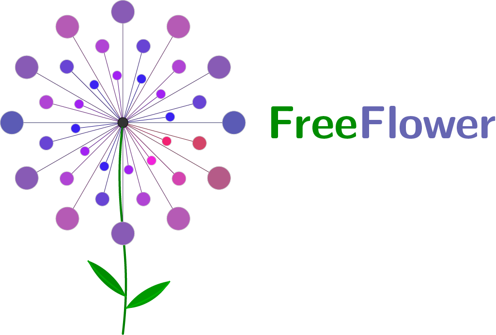

	 
	 
	© Educational Resources 
	 

## About

FreeFlower is an open-source project providing high-quality teaching materials for Swiss upper-secondary education (Gymnasium) with a focus on informatics. It integrates existing educational resources with a focus on informatics, meeting rigorous formal standards (see [Rules for Contribution](https://cyrilblum.github.io/FreeFlower/zusammenarbeit.html)). Built on LaTeX, this repository aims to support Swiss educational institutions through meta-analysis and effective material integration.

## GitHub Page

The project documentation is available on GitHub Pages:
https://cyrilblum.github.io/FreeFlower/

## Compiling FreeFlower

To compile this project, navigate to `main.tex` and chose to run either a `book`, `article`, `exam`, `beamer` or `flashcard` documentclass, using the toggles. Uncomment a line to compile a certain project. 

We recommend running the following **compilation sequences**
- `book`: `lualatex -> biber -> makeglossaries -> lualatex -> lualatex` 
- other document classes: `lualatex -> lualatex`

We recommend using VS Code for modifying the code.

## Add git hash to documents

If you wish to add a git hash to the document, execute the following steps:

- Navigate to the FreeFlower root directory
- `cp -a Git_Internal_Files/. .git/hooks`
- `cd .git/hooks/`
- `chmod ug+x post-checkout post-commit post-merge`
- add, commit and push any outstanding changes, then`git checkout`
- In main.tex, change the `showgitinfo2` toggle to `true`

## Contributing
Please let the authors know if you'd like to contribute.

## Licensing

Unless otherwise stated, all **educational content** in this repository (documents, slides, exercises, etc.) is licensed under the
[Creative Commons Attribution-NonCommercial-ShareAlike 4.0 International License (CC BY-NC-SA 4.0)](https://creativecommons.org/licenses/by-nc-sa/4.0/).
See [`LICENSE-CC-BY-NC-SA`](LICENSE-CC-BY-NC-SA) for the full license text.

**Source code, scripts, LaTeX classes/packages, and build tooling** are licensed under the
[GNU General Public License v3.0 or later (GPL-3.0-or-later)](https://www.gnu.org/licenses/gpl-3.0.html).
See [`LICENSE-GPL`](LICENSE-GPL) for the full license text.

## Contact
- [Thomas Graf](mailto:thomas.grf@edu.zh.ch), Kantonsschule Im Lee (KLW)
- [Cyril Blum](mailto:cyril.blum@edu.zh.ch), Kantonsschule Im Lee (KLW), Kantonsschule Stadelhofen Filiale Dübendorf (KST FDü)
