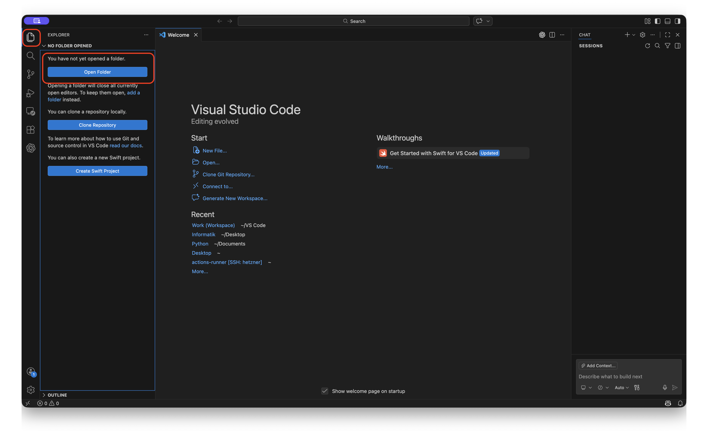
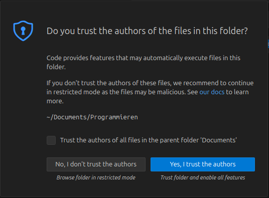
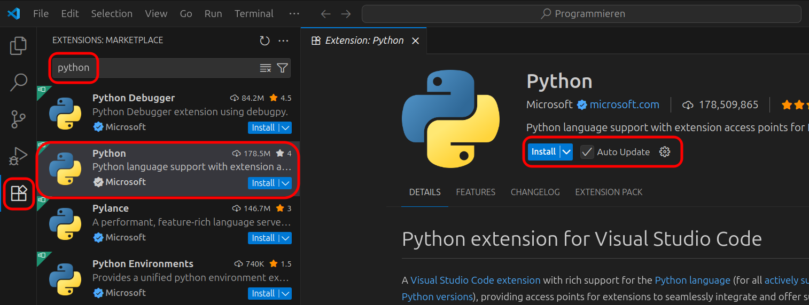
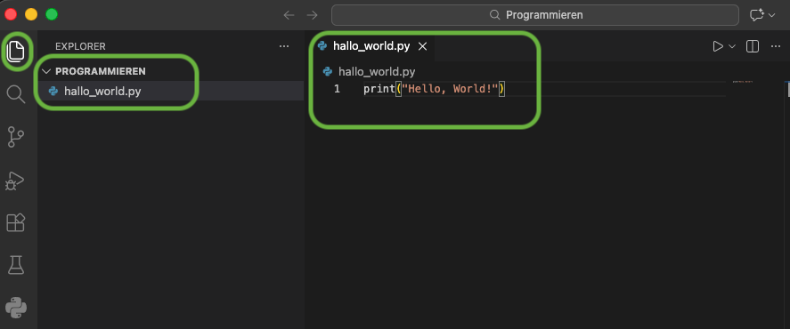
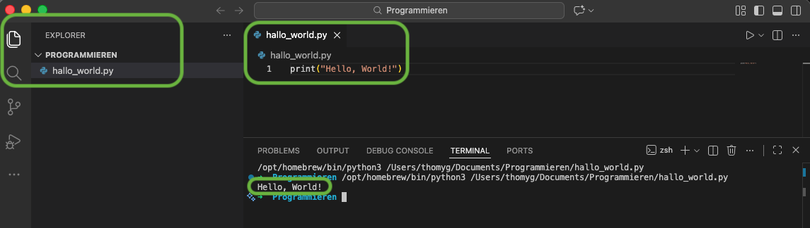

# VS Code für Python einrichten (macOS und Windows)

Diese Seite enthält die vollständigen Schritte aus dem Kapitel "Getting Started", inklusive aller Abbildungen.

## Installation von Python und VS Code

Um mit dem Programmieren loslegen zu können, müssen Sie zuerst die Programmiersprache Python auf Ihrem Computer installieren sowie einen guten Code-Editor, mit dem Sie Python-Code schreiben und ausführen können. Ein solches Programm wird typischerweise IDE (Integrated Development Environment) genannt. In diesem Skript verwenden wir die kostenfreie Programmiersprache Python sowie die ebenfalls kostenfreie, weit verbreitete IDE Visual Studio Code (VS Code).

### Anleitung für macOS

Um VS Code unter macOS zu installieren, benötigen Sie zuerst den Paketmanager Homebrew. Laut der offiziellen Webseite: "Homebrew installiert Zeug, das du brauchst, das Apple aber nicht mitliefert."

Falls Homebrew noch nicht installiert ist, gehen Sie wie folgt vor.

Öffnen Sie ein neues Terminal-Fenster, indem Sie zunächst die Spotlight-Suche mit Cmd + Leertaste öffnen. Geben Sie dort Terminal ein und bestätigen Sie mit Enter.

Führen Sie danach diesen Befehl aus:

```bash
/bin/bash -c "$(curl -fsSL https://raw.githubusercontent.com/Homebrew/install/HEAD/install.sh)"
```

Nach der Installation von Homebrew erhalten Sie im Terminal Hinweise zur Anpassung der Umgebungsvariable PATH. Folgen Sie diesen Instruktionen und führen Sie die dort vorgeschlagenen Befehle im selben Terminal aus.

Führen Sie danach die folgenden Befehle einzeln aus, jeweils mit Enter.

VS Code installieren:

```bash
brew install --cask visual-studio-code
```

Python 3 (neueste Version) installieren:

```bash
brew install python3
```

tkinter für turtle-Grafik installieren:

```bash
brew install python-tk
```

Nun sollten VS Code und Python installiert sein. Falls VS Code beim ersten Start von macOS blockiert wird, geben Sie das Programm in den macOS-Sicherheitseinstellungen frei.

### Anleitung für Windows

Öffnen Sie PowerShell als Administrator und führen Sie die folgenden Befehle nacheinander aus:

```powershell
winget install -e --id Microsoft.VisualStudioCode --scope machine --silent --accept-package-agreements --accept-source-agreements
winget install -e --id Python.Python.3.14 --scope machine --silent --accept-package-agreements --accept-source-agreements
```

Wenn beim Einfügen Leerzeichen fehlen, ergänzen Sie diese vor dem Ausführen manuell.


Danach sollte Visual Studio Code über das Windows-Startmenü auffindbar sein.

## VS Code für Python konfigurieren

Als erstes müssen Sie VS Code einen Ordner angeben, in dem Sie Python-Programme schreiben und speichern. Erstellen Sie dafür einen neuen Ordner, zum Beispiel Grundlagenfach, und legen Sie ihn idealerweise in einem Cloud-Dienst wie OneDrive ab. So werden Ihre Daten zwischen Geräten synchronisiert. In diesem Ordner sollten keine persönlichen Daten abgelegt werden.



Falls beim Öffnen Pop-ups zur Vertrauensfrage erscheinen, bestätigen Sie diese jeweils mit Yes, I trust the authors.



Öffnen Sie danach links in VS Code den Bereich Extensions, suchen Sie nach Python und installieren Sie die Erweiterung von Microsoft.



Erstellen Sie in Ihrem Arbeitsordner eine neue Datei mit dem Namen hello_world.py.



## Erstes Python-Programm schreiben und ausführen

Schreiben Sie dieses Programm in hello_world.py:

```python
print("Hello, World!")
```

Starten Sie das Programm mit dem Play-Button oben rechts in VS Code.



Das Programm gibt im Terminal den Text Hello, World! aus.
